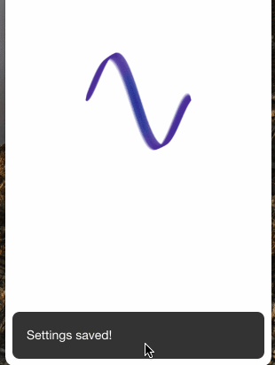

<p align="center">
  <br/>
  <a href="https://circleci.com/gh/Doka-NT/worklog-reminder/tree/main"></a>
</p>

# Worklog Reminder for JIRA


This app will help you with:

- Watch through your last issues
- Track time in 1-2 clicks
- Schedule notifications

## Overview
<table>
  <thead>
    <th colspan="2">Easy setup</th>
    <th colspan="2">Easy to use</th>
  </thead>  
  <tbody>
    <tr>
      <td></td>
      <td>
        Setup app in 4 simple steps:
        <ul>
          <li>Provide your JIRA server URL</li>
          <li>Enter your username</li>
          <li>Create or paste API token</li>
          <li>Done!</li>
        </ul>
      </td>
      <td></td>
      <td>
        Work with issues in 1-2 clicks%
        <ul>
          <li>Find issue in the list or use search bar</li>
          <li>Click on issue row and choose time</li>
          <li>Optionaly: provide a comment</li>
          <li>Done!</li>
        </ul>
      </td>
    </tr>
  </tbody>
</table>

## Main Features
- You need only 2 clicks to track time
- Search through last viewed issues
- Tray based application
- Minimalistic interface
- Schedule interval notifications as you want (1, 2, 3, .., 60 minutes and etc)
- Electron based application works on every desktop platform: Windows, Linux and MacOS

## Installation

### Requirements
- NodeJS >= 12
- Yarn
- Git (optional). You also can [download zip](https://github.com/Doka-NT/worklog-reminder/archive/refs/heads/main.zip)

### Install via git
```bash
git clone git@github.com:Doka-NT/worklog-reminder.git && cd worklog-reminder && yarn
```

### Compile ready-to-use app
To create ready-to-use application run the following command

#### Windows
```bash
yarn make -p win32
```

#### Linux
```bash
yarn make -p linux
```

#### MacOs
```bash
yarn make -p mas
```

After that go to the `out/make` directory and find a version for you platform

### Run in dev mode

```bash
yarn start
```
