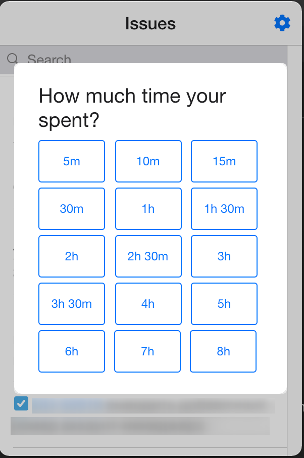
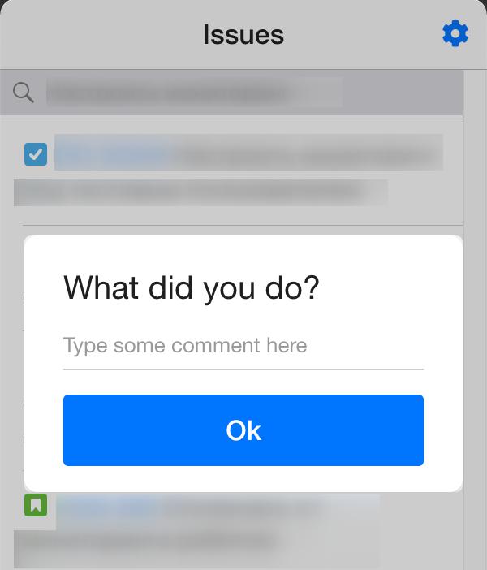
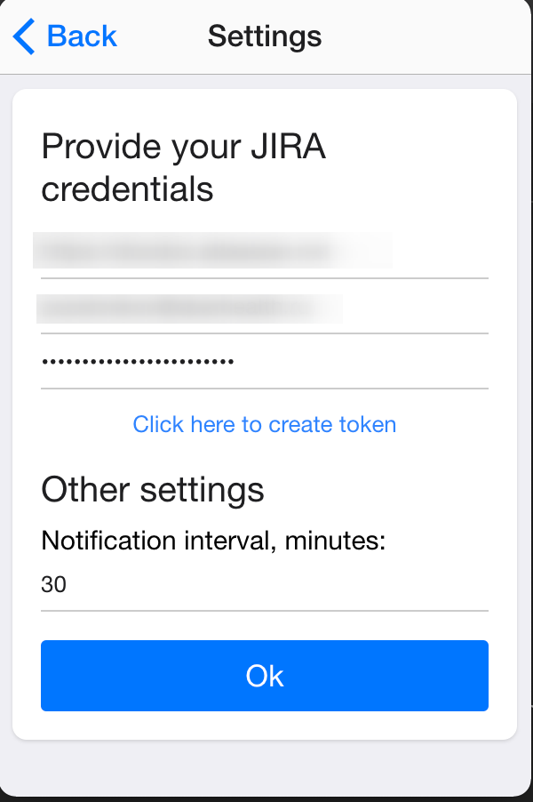

[](https://circleci.com/gh/Doka-NT/worklog-reminder/tree/main)

# Worklog Reminder

<a href="./docs/images/screenshot-picker.png"></a>
<a href="./docs/images/screenshot-comment.png"></a>
<a href="./docs/images/screenshot-settings.png"></a>

This app will help you with:

- Watch through your last issues
- Track time in 1-2 clicks
- Schedule notifications

## Main Features
- You need only 2 click to track time
- Search thourg last viewed issues
- Tray based application
- Minimalistic interface
- Schedule interval notifications as you want (1, 2, 3, .., 60 minutes and etc)
- Electron based application works on every desktop platform: Windows, Linux and MacOS

## Installation

```bash
git clone git@github.com:Doka-NT/worklog-reminder.git && cd worklog-reminder && yarn
```

### Compile ready-to-use app
To create ready-to-use application run the following command

```bash
yarn make
```

After that go to the `out/make` directory and find a version for you platform

### Run in dev mode

```bash
yarn start
```
