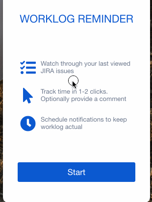

# Worklog Reminder for JIRA


App for tracking time and search JIRA issues
<br/><br/>

<a href="https://circleci.com/gh/Doka-NT/worklog-reminder/tree/main"></a>
<a href="https://www.codefactor.io/repository/github/doka-nt/worklog-reminder"></a>
<a href="https://codeclimate.com/github/Doka-NT/worklog-reminder/maintainability"></a>
<a href="https://www.codacy.com/gh/Doka-NT/worklog-reminder/dashboard?utm_source=github.com&amp;utm_medium=referral&amp;utm_content=Doka-NT/worklog-reminder&amp;utm_campaign=Badge_Grade"></a>
<br/>

## Main features

- 2 click to log your time
- Quick issue search
- Scheduled worklog reminder notifications
- Cross-platform (MacOS, Windows, Linux)
- Completely FREE

## Download
<a href="https://github.com/Doka-NT/worklog-reminder/releases/latest/download/worklog-reminder.dmg"></a>
<a href="https://github.com/Doka-NT/worklog-reminder/releases/latest/download/Worklog.Reminder.Setup.exe"></a>
<a href="https://github.com/Doka-NT/worklog-reminder/releases/latest/download/worklog-reminder.amd64.deb"></a>

[Other download options](https://github.com/Doka-NT/worklog-reminder/releases/latest)

## Overview



### Easy setup

Setup **Worklog Reminder** in 4 simple steps:

  • Provide your JIRA URL<br/>
  • Enter your username<br/>
  • Create or paste API token<br/>
  • Done!</br>

<br/><br/><br/><br/>


### Easy to use

Work with issues in 2 clicks:

  • Look through last viewed<br/>
  • Search for issues<br/>
  • Open issues in browser<br/>
  • Click on issue and choose time<br/>
  • Optionaly: provide a comment<br/>
  • Done!<br/>
  
<br/>

## Development

### Run in dev mode

```bash
yarn install
yarn start
```

### Create production build

```bash
yarn make
```

Generated assets will be created in `out/make` directory

## Support

If you have any question feel free to [create new issue](https://github.com/Doka-NT/worklog-reminder/issues/new)
